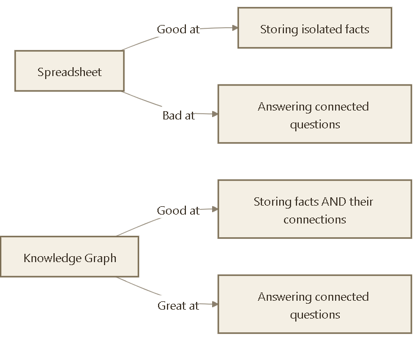
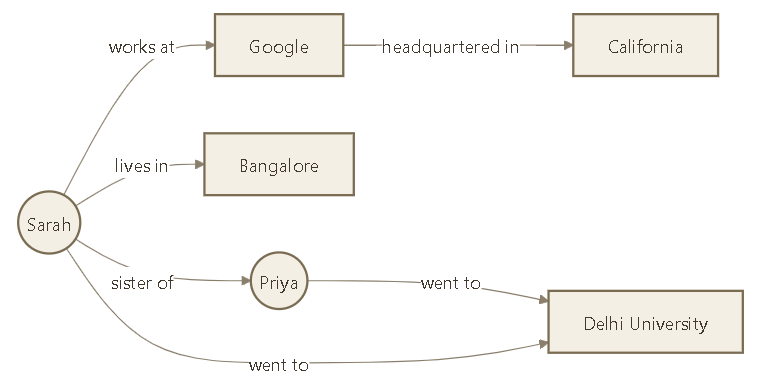
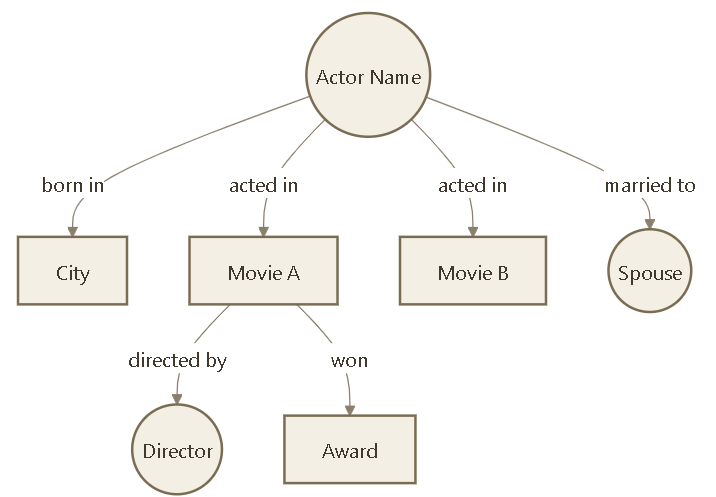
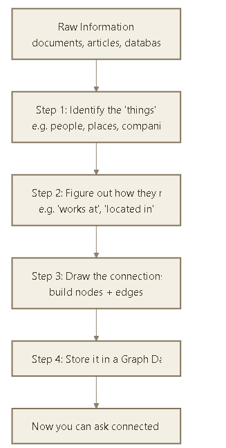
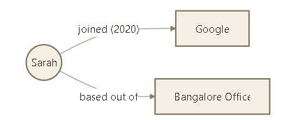

# Knowledge Graphs Explained (No Tech Degree Required)

Imagine you're at a party, and someone asks you: *"How do you know Sarah?"*

You might say: *"Sarah works at Google, she went to the same college as my sister, and she lives two blocks from my favorite coffee shop."*

Without realizing it, you just built a tiny **Knowledge Graph** in your head — a web of *things* (Sarah, Google, your sister, the coffee shop) connected by *relationships* (works at, went to college with, lives near).

That's really all a Knowledge Graph is: **a map of things and how they connect to each other.**

---

## 1. The Problem with Plain Lists and Tables

Most information today is stored in spreadsheets or lists — rows and columns. That works fine until you want to ask a *connected* question.

Take this simple table:

| Name | Company | City |
|------|---------|------|
| Sarah | Google | Bangalore |
| Raj | Google | Bangalore |
| Meera | Infosys | Pune |

This table can easily tell you "Where does Sarah work?" But it *struggles* with a question like:

> "Who works at the same company as Sarah, in the same city, and might know each other?"

You'd have to manually scan, cross-reference, and connect the dots yourself. A Knowledge Graph does this "connecting the dots" automatically — because the connections *are* the data, not an afterthought.

---

## 2. The Three Building Blocks

Every Knowledge Graph is made of just **three simple ingredients**:

1. **Nodes (Entities)** — the "things." People, places, companies, products, concepts. Think of these as the *dots*.
2. **Edges (Relationships)** — how those things connect. Think of these as the *lines* connecting the dots.
3. **Properties (Attributes)** — extra details about a node or edge. Like labels stuck on the dots and lines.

Here's Sarah's little world turned into an actual graph:

Notice something powerful: even though we never *directly* said "Sarah and Priya are connected to Delhi University together," you can now **see** it — because both of them link to the same node. That's the magic of graphs: hidden connections become visible.

---

## 3. A Real-World Example You've Already Seen

Ever Googled a celebrity or a company and seen that little info box on the right side of the search results — with their photo, birthday, spouse, movies, awards? That's Google's **Knowledge Graph** in action.

When you ask Google *"Who directed the movie this actor is most famous for?"* — it doesn't "read" a Wikipedia page top to bottom. It **walks the graph**: Actor → Movie → Director. Instant answer.

Other everyday examples:
- **Netflix/Amazon recommendations**: "People who liked this show also liked..." — that's graph traversal between Users, Shows, and Genres.
- **LinkedIn's "People You May Know"**: built by looking at your connections' connections — a graph, two steps deep.
- **Google Maps directions**: roads and intersections are literally a graph of nodes (intersections) and edges (roads).

---

## 4. How a Knowledge Graph Gets Built

You don't need to be a data scientist to understand the process — it's basically **Read → Identify → Connect → Store**.

**Example walk-through:**

Suppose this sentence exists in a company document:
> "Sarah joined Google in 2020 as a Product Manager, based out of the Bangalore office."

A Knowledge Graph builder would break this down like:

| What it finds | Type |
|---|---|
| Sarah | Entity (Person) |
| Google | Entity (Company) |
| Bangalore office | Entity (Location) |
| "joined" / "works at" | Relationship |
| "based out of" | Relationship |
| 2020 | Property (attached to the relationship) |

And it becomes:

Do this across thousands of documents, and you end up with a massive, richly connected web of knowledge — instead of thousands of disconnected paragraphs.

---

## 5. Why Not Just Use a Regular Database?

Here's a simple way to think about the difference:

| | Regular Database (Tables) | Knowledge Graph |
|---|---|---|
| **Best for** | Fixed, predictable questions | Open-ended, connected questions |
| **Structure** | Rows & columns | Dots & lines (nodes & edges) |
| **Relationships** | Implied through matching IDs (slow, manual) | Built directly into the data (fast, natural) |
| **Analogy** | A filing cabinet | A spider web / mind map |
| **Great at answering** | "What is Sarah's city?" | "How is Sarah connected to Raj, and through what?" |

Think of a table as a **filing cabinet** — great for looking up one specific drawer. A Knowledge Graph is more like a **mind map pinned to a wall with string connecting related notes** — you can trace a thread from any point to any other point.

---

## 6. The "Rulebook" Behind the Graph: Ontology

One more friendly term you'll hear: **ontology**. It sounds intimidating, but it's simply the **rulebook** that says what *types* of things and relationships are allowed in the graph.

For example, an ontology for a company graph might say:
- A **Person** can `work at` a **Company**
- A **Company** can be `headquartered in` a **City**
- A **Person** cannot `work at` a **City** (that relationship doesn't make sense)

This rulebook keeps the graph consistent and meaningful — like grammar rules for a language, so that everyone "speaks" the graph the same way.

---

## 7. Why This Matters Today

Knowledge Graphs are having a big moment because of AI. When an AI system (like a chatbot) needs to answer a question accurately, it helps enormously to have a *structured map of facts and their relationships* to check against — instead of just guessing from patterns in text. This is the foundation behind a technique called **GraphRAG**, where AI systems use a Knowledge Graph to fetch precise, connected facts before generating an answer — reducing made-up or incorrect information.

---

## In One Sentence

> A Knowledge Graph is simply a way of storing information as **things** and the **connections between them**, so that instead of hunting through isolated facts, you can follow the threads and see the full picture — just like your brain naturally does when you explain how you know someone at a party.
