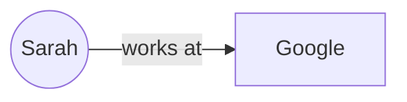
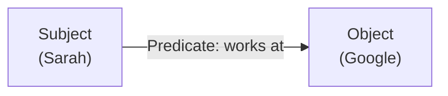
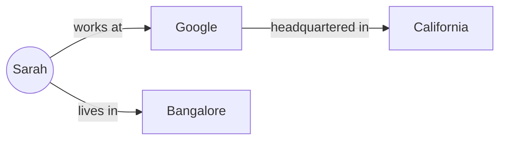
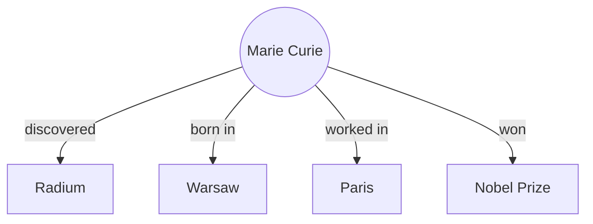
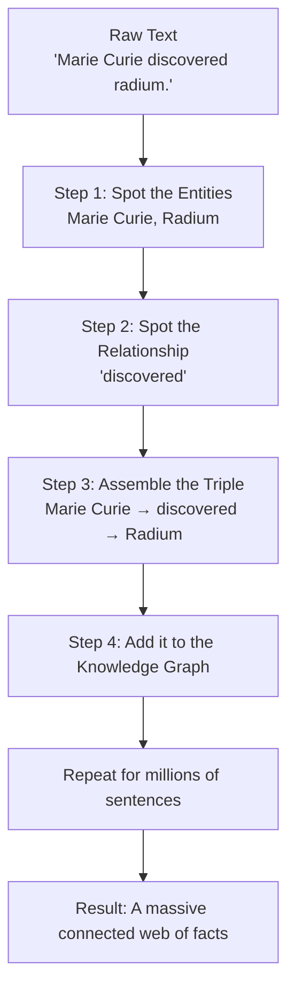

# Entities, Relationships, and Triples — Explained Simply

If Knowledge Graphs are like a web of connected facts, then **Entities, Relationships, and Triples** are the actual grammar of that web — the "nouns, verbs, and sentences" that make the whole thing work.

Let's break it down like you're hearing it for the very first time.

---

## 1. Start With a Simple Sentence

Take this everyday sentence:

> "Sarah works at Google."

Without knowing any technical terms, you already understand three things:
- There's a person: **Sarah**
- There's a company: **Google**
- There's a connection between them: **works at**

That's it. That's the entire concept. In Knowledge Graph language, this gets a special name:

| Plain English | Technical Term |
|---|---|
| A "thing" (Sarah, Google, Paris, iPhone) | **Entity** |
| How two things connect ("works at", "born in") | **Relationship** |
| The full mini-sentence combining both | **Triple** |

---

## 2. What Exactly Is an Entity?

An **Entity** is simply *any distinct thing* worth naming. It could be:

- A **person** — Sarah, Elon Musk, your neighbor
- A **place** — Paris, Bangalore, Mount Everest
- A **thing** — iPhone, a car, a book
- A **company/organization** — Google, WHO, your local bakery
- An **idea/concept** — Democracy, Photosynthesis, Diabetes

Basically: if you can point at it, name it, or refer to it as "a specific one of something," it's an entity.

> 🧠 **Simple test:** If you can put "the" or "a" in front of it and it makes sense as one specific item ("*the* Eiffel Tower," "*a* smartphone"), it's probably an entity.

---

## 3. What Exactly Is a Relationship?

A **Relationship** is the *verb* or *connector* that links two entities together. It answers: *"How are these two things related?"*

Examples of relationships:
- works at
- born in
- located in
- married to
- directed by
- part of
- causes

Relationships almost always have a **direction** — they flow from one entity to another. "Sarah works at Google" is not the same as "Google works at Sarah"!



The arrow direction matters — it tells you *who is doing what to whom.*

---

## 4. What Exactly Is a Triple?

Now here's the key idea that ties it all together. A **Triple** is just the fancy name for a complete fact, written in this exact three-part pattern:

```
[ Subject ]  →  [ Predicate ]  →  [ Object ]
  (Entity)      (Relationship)     (Entity)
```

This is often called **Subject–Predicate–Object**, or **S-P-O** for short — the same structure you learned in grammar class, just applied to data.

**Example:**

| Subject | Predicate | Object |
|---|---|---|
| Sarah | works at | Google |

Read left to right, it reconstructs the original sentence: *"Sarah works at Google."* That's a triple. One single fact, cleanly split into three labeled parts a computer can understand and connect to other facts.



---

## 5. Why Break Sentences Into Triples At All?

Because once every fact is in this same **Subject–Predicate–Object** shape, facts can be *linked together* — even if they came from completely different sentences or documents.

Take these three separate, unrelated-looking sentences:

1. "Sarah works at Google."
2. "Google is headquartered in California."
3. "Sarah lives in Bangalore."

Turned into triples:

| Subject | Predicate | Object |
|---|---|---|
| Sarah | works at | Google |
| Google | headquartered in | California |
| Sarah | lives in | Bangalore |

Now watch what happens when we connect these triples into one picture:



Suddenly you can answer a question that **no single sentence answered on its own**:

> "Does Sarah work in the same place she lives?"

Answer: No — she works for a company headquartered in California, but lives in Bangalore. You figured that out just by *following the arrows*, not by re-reading paragraphs.

This is the entire secret of Knowledge Graphs: **millions of small triples, stitched together, create a giant web of connected understanding.**

---

## 6. A Bigger Example — Building a Mini Knowledge Graph

Let's take a short paragraph and convert it into triples step by step.

> "Marie Curie discovered radium. She was born in Warsaw and later worked in Paris. Marie Curie won the Nobel Prize."

**Step 1: Identify the entities**

| Entity | Type |
|---|---|
| Marie Curie | Person |
| Radium | Element |
| Warsaw | City |
| Paris | City |
| Nobel Prize | Award |

**Step 2: Identify the relationships**

| Relationship | Meaning |
|---|---|
| discovered | connects a person to their discovery |
| born in | connects a person to their birthplace |
| worked in | connects a person to a work location |
| won | connects a person to an award |

**Step 3: Form the triples**

| Subject | Predicate | Object |
|---|---|---|
| Marie Curie | discovered | Radium |
| Marie Curie | born in | Warsaw |
| Marie Curie | worked in | Paris |
| Marie Curie | won | Nobel Prize |

**Step 4: Visualize it as a graph**



Four short triples, and suddenly you have a mini "profile" of Marie Curie that a computer can query, search, and reason over — far more usefully than a single paragraph of text.

---

## 7. How This Process Actually Happens (The Flow)

When companies build Knowledge Graphs from documents, articles, or databases, they roughly follow this pipeline:



---

## 8. Quick Reference Table

| Term | Plain Meaning | Example |
|---|---|---|
| **Entity** | A "thing" — a person, place, object, or concept | Sarah, Google, Paris |
| **Relationship** | How two entities connect (the verb) | works at, born in, discovered |
| **Triple** | One complete fact: Subject → Predicate → Object | Sarah → works at → Google |
| **Subject** | The entity the fact is *about* | Sarah |
| **Predicate** | The relationship/action | works at |
| **Object** | The entity the subject is connected *to* | Google |

---

## 9. Common Mix-Ups (Cleared Up)

- **"Isn't a relationship just an entity too?"**
  No — an entity is a "noun" (a thing), a relationship is the "verb" connecting two nouns. Google is an entity; "works at" is a relationship, not a thing itself.

- **"Can one entity have many relationships?"**
  Yes, absolutely! Sarah could have dozens of triples: works at Google, lives in Bangalore, friends with Raj, studied at Delhi University, and so on. Real-world entities are usually the *center* of many triples.

- **"Does direction really matter?"**
  Yes. "Sarah works at Google" and "Google works at Sarah" describe completely different (and one nonsensical) situations. The arrow always points from Subject to Object.

---

## In One Sentence

> An **entity** is a thing, a **relationship** is how two things connect, and a **triple** is simply one clean fact — Subject → Predicate → Object — that becomes a single building block; connect enough of these tiny building blocks together, and you get a full Knowledge Graph.
